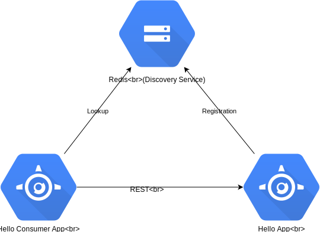

# vertx-cf-demo

### App Structure

These demo app contains two [vert.x](http://vertx.io/) based micro-services 
[Hello Service](./hello-service) and [Hello Consumer Service](./hello-consumer-services) 
which use [Redis](https://redis.io) as a Discovery Service.




## CouldFoundry

### Installation

1. VirtualBox

2. CloudFoundry CLI [Installing the cf CLI](https://docs.cloudfoundry.org/cf-cli/install-go-cli.html)

3. PCF Dev [Download](https://network.pivotal.io/products/pcfdev)

### Running PCF Dev

```
cf dev start -s redis
```

```
cf create-service p-redis shared-vm my-redis
```

### Compilation

```
mvn package
```

### Deployment

[Hello Service](./hello-service#deploy-to-cloud-foundry)

[Hello Consumer Service](./hello-consumer-service#deploy-to-cloud-foundry)


